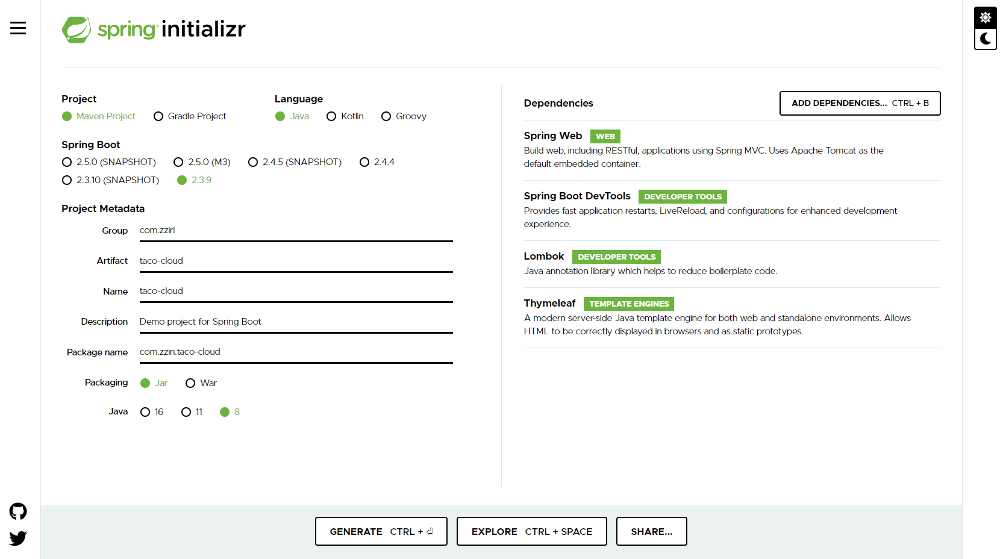

# 스프링 시작하기

- 스프링과 스프링 부트 핵심사항
- 스프링 프로젝트 생성하기
- 스프링 개요

## 스프링이란?

page 4

스프링 애플리케이션 컨텍스트라는 컨테이너를 제공하는데, 이것은 애플리케이션 컴포넌트들을 생성하고 관리한다

애플리케이션 컴포넌트(빈)들은 스프링 애플리케이션 컨텍스트 내부에서 의존성 주입을 통해 연결된다 (일반적인 new object() 와는 다름, 예를 들어 @Autowired)

```java
@Configuration
public class ServiceConfiguration {
    @Bean
    public InventoryService inventoryService() {
        return new InventoryService();
    }
    @Bean
    public ProductService productService() {
        return new ProductService(inventoryService());
    }
}
```

사실상 위 코드는 자동 연결과 컴포넌트 검색 기능이 있어서 쓸 일이 별로 없다


## 스프링 애플리케이션 초기 설정

page 7

https://start.spring.io/



Project Object Model

groupId : 프로젝트(그룹) 고유 식별자

artifactId : 버전정보를 생략한 jar 파일명

@SpringBootApplication = @SpringBootConfiguration + @EnableAutoConfiguration + @ComponentScan

## 스프링 애플리케이션 작성

page 18

웹 요청과 응답을 처리하는 컴포넌트인 Controller

```java
@Controller
public class HomeController {
    @GetMapping("/")
    public String home() {
        return "home";
    }
}
```

@Controller Annotation을 사용하면 스프링의 컴포넌트 검색에서 자동으로 HomeController 클래스를 찾고 Bean으로 인스턴스를 생성한다 (Singleton이 기본)

```java
@WebMvcTest
class HomeControllerTest {

    @Autowired
    private MockMvc mockMvc;

    @Test
    public void testHomePage() throws Exception {
        mockMvc.perform(MockMvcRequestBuilders.get("/"))
                .andExpect(MockMvcResultMatchers.status().isOk())
                .andExpect(MockMvcResultMatchers.view().name("home"))
                .andExpect(MockMvcResultMatchers.content().string(containsString("Welcome to...")));
    }
}
```

@WebMvcTest Annotation을 사용하면 스프링 MVC 애플리케이션의 형태로 테스트가 실행되도록 한다

스프링 부트에는 톰캣 내장

