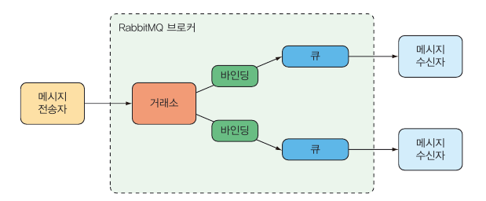

# 8 비동기 메시지 전송하기

- 비동기 메시지 전송
- JMS, RabbitMQ, Kafka를 사용해서 메시지 전송하기
- 브로커에서 메시지 가져오기
- 메시지 리스닝하기


## 8.2 RabbitMQ와 AMQP 사용

RabbitMQ는 AMQP의 구현체
AMQP 메시지는 수신자가 리스닝하는 큐와 분리된 거래소 이름과 라우팅 키를 주소로 사용
JMS는 수신자가 가져갈 메시지 도착지의 이름을 주소로 사용



메시지 송신 -> RabbitMQ의 브로커 -> 거래소 -> 하나 이상의 큐에 전달


- 기본 거래소 : 자동 생성되는 거래소. 라우팅 키와 이름이 같은 큐로 전달. 기본적으로 모든 큐는 자동으로 기본 거래소에 연결

- 디렉트 거래소 : 바인딩 키가 메시지의 라우팅 키와 같은 큐에 전달

- 토픽 거래소 : 와일드 카드 포함 바인딩 키가 메시지의 라우팅 키와 같은 큐에 전달

- 팬아웃 거래소 : 모든 연결된 큐에 전달

- 헤더 거래소 : 토픽 거래소와 유사. 라우팅 키 대신 메시지 헤더 값

- 데드 레터 거래소 : 큐에 전달 안된 모든 메시지 보관


메시지는 라우팅 키를 가지고 거래소로 전달되며 큐에서 읽어지고 소비된다는 것이 가장 중요한 개념


### 8.2.1 RabbitMQ를 스프링에 추가

```shell
<dependency>
	<groupId>org.springframework.boot</groupid>
	<artifactId>spring-boot-starter-amqp</artifactId>
</dependency>
```

AMQP 스타터를 추가하는 것만으로 AMQP 연결 팩토리, RabbitTemplate 빈을 생성하는 자동-구성이 수행.

```shell
spring:
	profiles: prod
	rabbitmq:
		host: rabbit.tacocloud.com
		port: 5673
		username: tacoweb
		password: l3tm31n
```


### 8.2.2 RabbitTemplate을 사용해서 메시지 전송

RabbitTemplate 메서드는 거래소와 라우팅 키의 형태로 메시지를 전송

```java
// 원시 메시지를 전송
void send(Message message) throws AmqpException;
void send(String routingKey, Message message) throws AmqpException;
void send(String exchange, String routingkey, Message message)
							throws AmqpException;

// 객체로부터 변환된 메시지를 전송
void convertAndSend(Object message) throws AmqpException;
// ...

// 객체로부터 변환되고 후처리(post-processing)되는 메시지를 전송
void convertAndSend(Object message, MessagePostProcessor mPP)
							throws AmqpException;
// ...
```

객체로부터 변환되고 후처리되는 메시지를 전송하는 Example


```java
// messageConverter Bean 등록 안하면 SimpleMessageConverter로 수행
@Bean
public MessageConverter messageConverter() {
	return new Jackson2JsonMessageConverter();
}
```


```java
@Service
public class RabbitOrderMessagingService
       implements OrderMessagingService {
  
  private RabbitTemplate rabbit;
  
  @Autowired
  public RabbitOrderMessagingService(RabbitTemplate rabbit) {
    this.rabbit = rabbit;
  }
  
  public void sendOrder(Order order) {
    rabbit.convertAndSend("tacocloud.order.queue", order,
        new MessagePostProcessor() {
          @Override
          public Message postProcessMessage(Message message)
              throws AmqpException {
            MessageProperties props = message.getMessageProperties();
            props.setHeader("X_ORDER_SOURCE", "WEB");
            return message;
          } 
        });
  }
// @FunctionalInterface
// public interface MessagePostProcessor
}
```


### 8.2.3 RabbitMQ로부터 메시지 수신

두 가지 선택지 있음

- RabbitTemplate을 사용해서 큐에서 메시지 가져옴
- @RabbitListener가 지정된 메시지로 메시지가 Push


Pull 모델 기반 방법

```java
@Profile("rabbitmq-template")
@Component("templateOrderReceiver")
public class RabbitOrderReceiver implements OrderReceiver {

  private RabbitTemplate rabbit;

  public RabbitOrderReceiver(RabbitTemplate rabbit) {
    this.rabbit = rabbit;
  }
  
  public Order receiveOrder() {
    return (Order) rabbit.receiveAndConvert("tacocloud.order.queue");
    // return rabbit.receiveAndConvert("tacocloud.order.queue",
    //					new ParameterizedTypeReference<Order>() {});
  }
}
```


리스너 기반 방법

```java
@Component
public class OrderListener {
	private KitchenUI ui;
	
	@Autowired
	public OrderListener(KitchenUI ui) {
		this.ui = ui;
	}
	
	@RabbitListener(queues = "tacocloud.order.queue")
	public void receiveOrder(Order order) {
		ui.displayOrder(order);
	}
}
```

