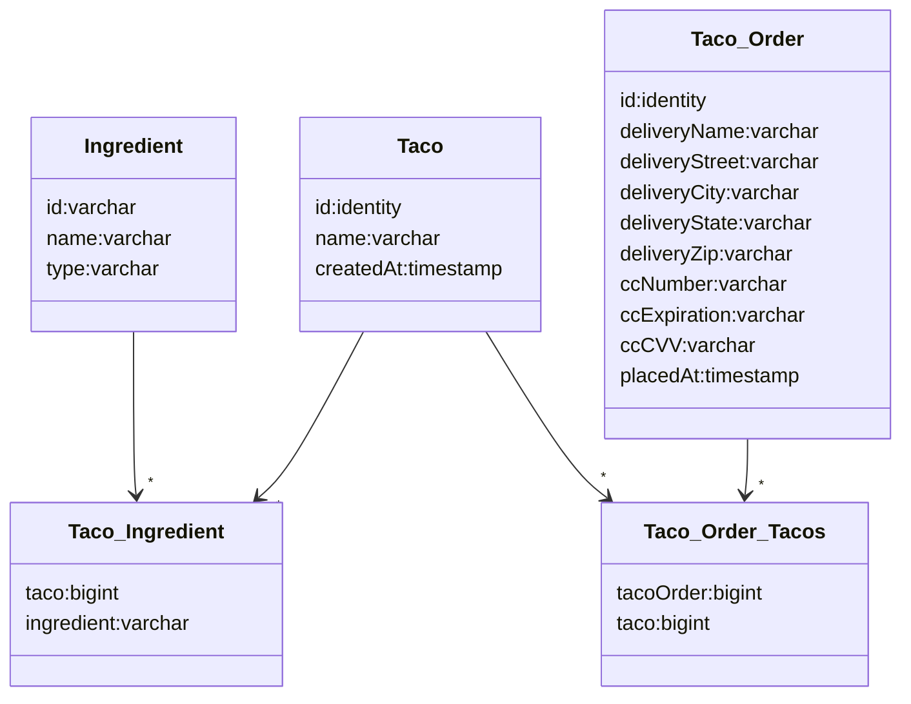

스터디 일자 : 04/22  
범위 : Chapter3. 데이터로 작업하기    
작성 : Sumin

[toc]


## Chapter 3. Preview

## 목표
2장+'데이터 퍼시스턴스'
JDBCTemplate -> JPA


## DB구조



- Ingredient : Taco 재료 정보 저장하는 Table
- Taco : Taco 저장용 Table
- Taco_Ingredient : Taco 생성시, 어떤 재료쓰였는지 저장하는 Table
- Taco_Order : Order정보 저장 Table
- Taco_Order_Tacos : Order 저장시, 어떤 Taco와 연관있는지 저장하는 Table

위 내용을 순서대로 구현~


## by JdbcTemplate
옛날 옛날에, JDBC API
```java
@Override
public Ingredient findById(String id) {
        Connection conn = null;
        PreparedStatement pstmt = null;
        ResultSet rs = null;
        try {
            connnection = dataSource.getConnection();
          	statement = connection.prepareStatement(
            "select id,name,type from Ingredient where id = ?");
          	statement.setString(1,id);
          	rs = statement.executeQuery();
          	Ingredient ingredient = null;
            if (rs.next()) {
                Ingredient = new Ingredient(
                  rs.getString("id"),
                	rs.getString("name"),
                  Ingredient.Type.valueOf(rs.getString("type")));
            } return ingredient;
        } catch (SQLException e) {
            throw new IllegalStateException(e);
        } finally {
        		if(rs != null){
              try{
                rs.close();
              }catch (SQLException e){}
            }
            if(statement != null){
                try{
                  statement.close();
                }catch (SQLException e){}
              }
            if(connection != null){
                try{
                  connection.close();
                }catch (SQLException e){}
             }
        }
    }
```
-> JdbcTemplate
```java
@Override
public Ingredient findById(String id) {
  return jdbc.queryForObject(
    "select id, name, type from Ingredient where id=?",
    this::mapRowToIngredient, id);
}

private Ingredient mapRowToIngredient(ResultSet rs, int rowNum)
  throws SQLException {
  return new Ingredient(
    rs.getString("id"),
    rs.getString("name"),
    Ingredient.Type.valueOf(rs.getString("type")));
}
```
-> JPA

```java
@NoArgsConstructor(access=AccessLevel.PRIVATE, force=true)
@Entity
public class Ingredient { }

public interface IngredientRepository extends CrudRepository<Ingredient, String> {
}
```

### 	

### JdbcTemplate설정

- pom.xml : jdbc + h2 설정
```xml
<properties>
    ...
    <h2.version>1.4.196</h2.version>
</properties>

<dependencies>
    ...
    <dependency>
        <groupId>org.springframework.boot</groupId>
        <artifactId>spring-boot-starter-jdbc</artifactId>
    </dependency>
    <dependency>
        <groupId>com.h2database</groupId>
        <artifactId>h2</artifactId>
        <scope>runtime</scope>
    </dependency>
</dependencies>
```
- sql정보 upload : schema.sql, data.sql

#### 

### 	Repository 정의

'Repository 생성 + Controller 연결'  - Ingredient, Taco, Order

@Repository : 컴포넌트 스캔 -> 스프링 어플리케이션 컨텍스트의 빈으로 생성

##### 	Ingredient

	- mapRowToIngredient()
	- /design 에서 checkbox

##### 	Taco, Order

​	Ingredient save()보다 추가적인 처리 필요 ( Table 2개에 걸쳐저장됨 & key 값필요)

 - 직접 update - TacoRepository

   PreparedStatementCreator, KeyHolder

   +a ) @SessionAttributes, @ModelAttribute

 - SimpleJdbcInsert - OrderRepository

   SimpleJdbcInsert, ObjectMapper

##### Converter